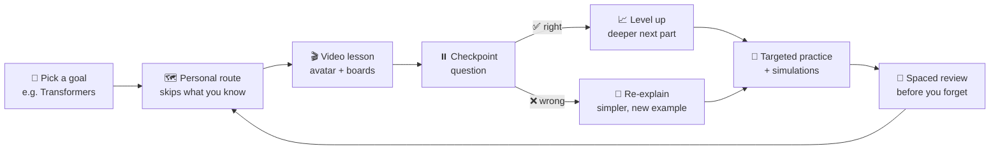
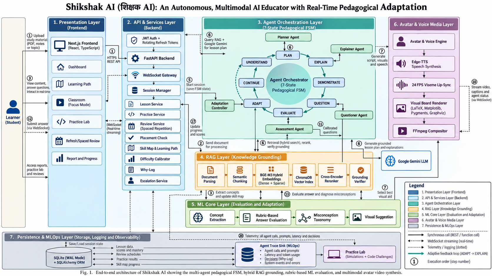
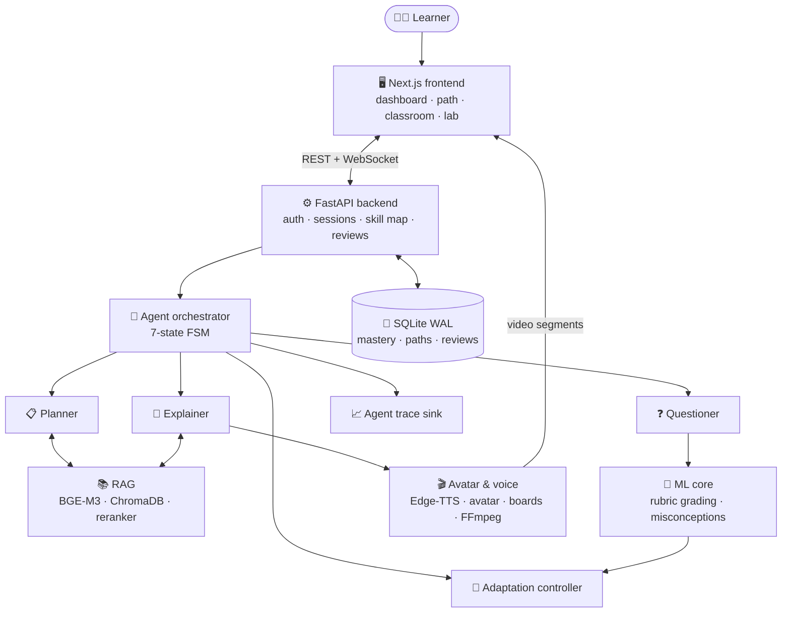

<div align="center">

# 🎓 Shikshak AI · शिक्षक AI

### A personalised AI tutor for learning AI

*Builds your learning path · teaches on video with an AI avatar · checks your understanding · adapts difficulty, explanations and practice to your progress*

<br/>

[](https://www.python.org/)
[](https://fastapi.tiangolo.com/)
[](https://nextjs.org/)
[](https://react.dev/)
[](https://www.typescriptlang.org/)
<br/>
[](https://ai.google.dev/)
[](https://huggingface.co/BAAI/bge-m3)
[](https://sqlite.org/wal.html)
[](#-option-c--docker-any-os)
[](#%EF%B8%8F-setup--installation)

<br/>

**🏆 Build Fast with AI Hackathon** · Problem statement: *Personalised AI Tutor for Learning AI*

[🌐 Live demo](https://shikshak-ai-ten.vercel.app/) · [▶️ Demo video](https://drive.google.com/drive/folders/1infdc3RWzBQl95rh4vZ49I8wZBQgEkA3?usp=sharing) · [⚡ Quick start](#-quick-start-tldr) · [🧭 2-minute walkthrough](#-try-it-in-2-minutes-judge-walkthrough)

</div>

---

## 📑 Table of Contents

| | Section | What you'll find |
| :---: | :--- | :--- |
| ⚡ | [Quick start (TL;DR)](#-quick-start-tldr) | Run the project in 3 commands |
| 💡 | [Project overview](#-project-overview) | The problem, our solution, and how it maps to the problem statement |
| ✨ | [Key features](#-key-features) | Everything the tutor does, grouped by purpose |
| 🏗️ | [System architecture](#%EF%B8%8F-system-architecture) | How the pieces fit together, with diagrams |
| 🛠️ | [Technologies used](#%EF%B8%8F-technologies-used) | The full stack, layer by layer |
| 📁 | [Project structure](#-project-structure) | Where everything lives in the repo |
| ⚙️ | [Setup & installation](#%EF%B8%8F-setup--installation) | Step-by-step for 🪟 Windows, 🍎 macOS and 🐧 Linux |
| 🚀 | [How to run the project](#-how-to-run-the-project) | Local, Docker and production modes |
| 🧭 | [2-minute walkthrough](#-try-it-in-2-minutes-judge-walkthrough) | A guided tour of the best moments |
| 🧪 | [Testing](#-testing) | Running the test suites |
| 🩺 | [Troubleshooting](#-troubleshooting) | Fixes for common problems, per OS |
| 👥 | [Team](#-team) | Who built it |

> [!TIP]
> **Judges:** the fastest path is [⚡ Quick start](#-quick-start-tldr) → [🧭 2-minute walkthrough](#-try-it-in-2-minutes-judge-walkthrough). No API keys are needed to run it.

---

## ⚡ Quick start (TL;DR)

> Needs **Python 3.10+**, **Node.js 20+** and **pnpm**. Full per-OS steps are in [⚙️ Setup](#%EF%B8%8F-setup--installation).

```bash
git clone https://github.com/Sagnik120/SHIKSHAK-AI.git && cd SHIKSHAK-AI
```

| Step | 🍎 macOS / 🐧 Linux | 🪟 Windows (PowerShell) |
| :--- | :--- | :--- |
| **1. Backend** | `python3 -m venv .venv && source .venv/bin/activate && pip install -r requirements.txt && python scripts/run_server.py` | `py -m venv .venv; .\.venv\Scripts\Activate.ps1; pip install -r requirements.txt; python scripts\run_server.py` |
| **2. Frontend** *(new terminal)* | `cd FRONTEND && pnpm install && pnpm dev` | `cd FRONTEND; pnpm install; pnpm dev` |
| **3. Open** | **http://localhost:3000** | **http://localhost:3000** |

🔑 Log in with the seeded demo learner: **`demo@shikshak.ai`** / **`DemoStudent@123`**

---

## 💡 Project Overview

### 🎯 The problem statement

> **Personalised AI Tutor for Learning AI**
> *Build an adaptive AI tutor that creates personalised learning paths and adjusts difficulty, explanations, and practice based on each learner's progress.*

### 😟 Why this is hard today

Everyone is learning AI, but most courses teach it the **same way, at the same pace, to everyone**. AI concepts stack on each other (gradients → backprop → attention → transformers), so missing one quietly breaks everything after it. Videos don't notice when you're lost, and chatbots wait for you to know what to ask.

### 🌱 Our solution

**Shikshak AI** is an AI teacher that **notices**. It builds a route to whatever you want to understand, teaches each step on video with a lip-synced avatar, **pauses to check you understood**, and changes *how* it teaches the moment you don't.



### ✅ How every part of the problem statement is covered

| Problem statement asks for | How Shikshak AI does it | Where to see it |
| :--- | :--- | :--- |
| 🗺️ **Personalised learning paths** | AI skill map of 70+ concepts (probability → Mamba) · goal-driven routes that skip mastered prerequisites · auto-inserted recaps · placement check · grows itself when you add a new AI topic | **Learning path** page |
| 📶 **Adjusts difficulty** | Live 1–5 level: 2 right in a row → step up, a miss → step down · carries into your next lesson | ●●●○○ meter in the classroom |
| 💬 **Adjusts explanations** | Re-explain → rebuild in simpler steps → hand to a mentor · each lesson is planned around what *you* already know | **Why?** tab in the classroom |
| 🧪 **Adjusts practice** | Fresh questions aimed at your weakest concepts (easier where you struggled, harder as a stretch) · interactive AI simulations | Lesson **Practice** page · **Practice Lab** |
| 📈 **Based on each learner's progress** | Per-concept mastery from graded answers · spaced review brings fading concepts back · reports | **Progress**, **Refresh**, lesson **Report** |
| 🤖 **Learning *AI*** | AI-specific curriculum, AI simulations (gradient descent, overfitting, attention) | **Practice Lab** |

---

## ✨ Key Features

<table>
<tr>
<td width="50%" valign="top">

### 🗺️ Personalised learning path
- 🎯 **Three ways to learn:** *Learn AI from zero*, *reach a specific topic*, or *just explore*
- 🧩 **Skill map:** 6 tracks (Math · Classical ML · Deep learning · Language & transformers · Generative AI · Frontier)
- 🧭 **Goal routes** with a reason for every step
- 📝 **Placement check:** ~6 adaptive questions, graded on the server
- 🌱 **Self-growing map:** type any new AI topic and the AI places it under its prerequisites

</td>
<td width="50%" valign="top">

### 🧠 Adaptive teaching engine
- 🔄 **7-state FSM:** Understand → Plan → Explain → Question → Evaluate → Adapt → Continue
- 🤝 **Specialised agents:** Planner, Explainer, Questioner, Assessor, Adaptation Controller
- 📶 **Live difficulty** (levels 1–5) shapes every next explanation and question
- 🪜 **Escalation ladder:** re-explain → rebuild → mentor handover
- 💡 **"Why?" log:** every adaptive decision explained in plain words

</td>
</tr>
<tr>
<td valign="top">

### 🎬 Multimodal video lessons
- 🗣️ **Edge-TTS** voice in English and Hindi
- 👩‍🏫 **Illustrated avatar** with blinking, head motion and 6 lip-sync mouth shapes
- 🧾 **Visual boards:** concept maps, flows, LaTeX equations, plots, code
- 🎞️ **FFmpeg compositor** streams segments live over WebSocket
- ⏸️ **In-video checkpoints** placed at sentence boundaries

</td>
<td valign="top">

### 🧪 Practice & retention
- 🎯 **Targeted practice** generated for your weakest concepts
- 🔬 **Practice Lab:** predict → run → see why simulations
- 🔄 **Spaced review:** 2 → 5 → 12 → 30 → 60-day intervals
- 📊 **Reports:** strengths, gaps, misconceptions
- 🔥 **Streaks, levels and badges**

</td>
</tr>
<tr>
<td valign="top">

### 📚 Grounded in your material (RAG)
- 📄 Upload **PDF, DOCX, PPTX, TXT, MD**
- 🔎 **BGE-M3 dense + sparse** hybrid retrieval in **ChromaDB**
- 🎯 **Cross-encoder reranking** + agentic query refinement
- 📌 Page-level **citations**; weak matches are refused, not guessed

</td>
<td valign="top">

### 🔐 Production-grade platform
- 🔑 JWT + rotating HTTP-only refresh tokens, bcrypt, login lockout
- ✉️ OTP email verification (SMTP / Resend, with a dev fallback)
- 💾 Durable sessions in **SQLite WAL**: lessons resume where they stopped
- 🌐 Full **English / हिन्दी** interface
- 📈 Agent trace sink for observability · 🐳 Docker ready

</td>
</tr>
</table>

---

## 🏗️ System Architecture

<div align="center">



*Fig. 1. End-to-end architecture: multi-agent pedagogical FSM, hybrid RAG grounding, rubric-based evaluation and multimodal avatar video.*

</div>

### 🔄 Request flow



### 🪜 The teaching loop, step by step

| # | Stage | What happens |
| :---: | :--- | :--- |
| 1️⃣ | **Ingest** | Your topic or document is parsed, chunked, embedded with BGE-M3 and indexed in ChromaDB |
| 2️⃣ | **Plan** | The Planner builds a lesson from your goal, your route and your past mastery |
| 3️⃣ | **Explain** | The Explainer writes a script at your current difficulty level; the media engine renders voice, avatar and boards |
| 4️⃣ | **Stream** | Video segments stream live to the classroom over WebSocket |
| 5️⃣ | **Check** | The video pauses for a checkpoint question; the ML core grades it against a rubric |
| 6️⃣ | **Adapt** | Difficulty moves, and the controller continues, re-explains, rebuilds or escalates; the Why? log records the reason |
| 7️⃣ | **Remember** | Mastery updates your skill map, the next step is chosen, and a spaced review is scheduled |

---

## 🛠️ Technologies Used

| Layer | Technologies |
| :--- | :--- |
| 🖥️ **Frontend** | Next.js 16 · React 19 · TypeScript · Tailwind CSS 4 · TanStack Query · Motion · React Three Fiber · Lucide · Sonner |
| ⚙️ **Backend** | Python 3.10+ · FastAPI · WebSockets · Pydantic · Uvicorn |
| 💾 **Database** | SQLite (WAL mode) · SQLAlchemy ORM (new columns are added automatically on start) |
| 🧠 **LLM & agents** | Google Gemini · custom multi-agent orchestration (FSM) · built-in offline teacher when no key is set |
| 📚 **RAG** | BGE-M3 hybrid embeddings · ChromaDB · cross-encoder reranker · agentic query refinement |
| 📝 **ML / NLP** | Rubric evaluator · misconception taxonomy · concept extraction |
| 🎬 **Media** | Edge-TTS · Pillow avatar renderer · Matplotlib · LaTeX (mathtext) · Pygments · FFmpeg (system or bundled `imageio-ffmpeg`) |
| 🔐 **Security** | JWT · rotating refresh tokens · bcrypt · rate limiting · OTP verification |
| 🚢 **DevOps** | Docker · Docker Compose · Render · pytest |

---

## 📁 Project Structure

```text
SHIKSHAK-AI/
├── 🖥️ FRONTEND/                    Next.js 16 web app (learner, mentor, admin)
│   └── src/
│       ├── app/                    Routes: dashboard, path, learn, lab, refresh, review, report, progress…
│       ├── components/             UI, lesson, lab and layout components
│       ├── features/classroom/     Live classroom controller and panels
│       └── core/                   API client, types, i18n (en / hi)
├── 🧩 modules/
│   ├── backend/                    FastAPI app: routes, WebSocket, DB models, services
│   ├── ai_agent_orchestration/     Agents, prompts, schemas, 7-state FSM
│   ├── rag/                        Parsing, chunking, embedding, retrieval, grounding
│   ├── ml_core/                    Answer evaluation, misconceptions, concept extraction
│   ├── avatar_voice/               TTS, avatar, visual boards, FFmpeg compositor, fonts
│   ├── mlops/                      Agent trace logging
│   └── frontend/                   Legacy static frontend (served by the backend)
├── 🛠️ scripts/                     Server runner, preflight check, model download, demo helpers
├── 🧪 tests/                       Unit, integration, e2e, smoke and eval suites
├── 📚 docs/                        Architecture diagrams and visual assets
├── 🐳 Dockerfile · docker-compose.yml
├── 📋 requirements.txt · requirements-lite.txt
└── 🔧 .env.example
```

---

## ⚙️ Setup & Installation

### 📋 Prerequisites

| Tool | Version | Required? | Why |
| :--- | :--- | :---: | :--- |
| 🐍 **Python** | 3.10 or newer (3.11 recommended) | ✅ | Backend and AI modules |
| 🟩 **Node.js** | 20 or newer (LTS) | ✅ | Next.js frontend |
| 📦 **pnpm** | 9 or newer | ✅ | Frontend package manager |
| 🌿 **Git** | any | ✅ | Cloning the repo |
| 🎞️ **FFmpeg** | any recent | ➖ Optional | Faster video composition. A bundled copy is used if it's missing |
| 🔤 **FriBidi** | any | ➖ Optional | Correct Hindi text shaping on video boards (macOS / Linux) |
| 🔑 **Gemini API key** | — | ➖ Recommended | Live AI teaching. Free from [Google AI Studio](https://aistudio.google.com/app/apikey). Without it, a built-in offline teacher runs |

Pick your operating system and follow the steps **in order**. Each step ends with a ✅ check, so you know it worked before moving on.

<details open>
<summary><h3>🪟 Windows 10 / 11</h3></summary>

> Run these in **PowerShell**. Commands for the classic Command Prompt are given where they differ.

**1️⃣ Install the tools** (skip any you already have)
```powershell
winget install -e --id Python.Python.3.11
winget install -e --id OpenJS.NodeJS.LTS
winget install -e --id Git.Git
winget install -e --id Gyan.FFmpeg        # optional
```
Close and reopen PowerShell so the new tools are on your `PATH`, then:
```powershell
npm install -g pnpm
```
✅ Check: `py --version`, `node --version` and `pnpm --version` all print a version.

**2️⃣ Get the code**
```powershell
git clone https://github.com/Sagnik120/SHIKSHAK-AI.git
cd SHIKSHAK-AI
```

**3️⃣ Create and activate a Python virtual environment**
```powershell
py -3.11 -m venv .venv
.\.venv\Scripts\Activate.ps1
```
> If activation is blocked ("running scripts is disabled"), run once:
> `Set-ExecutionPolicy -Scope CurrentUser RemoteSigned`, then activate again.
> In **Command Prompt**, activate with `.venv\Scripts\activate.bat`.

✅ Check: your prompt now starts with `(.venv)`.

**4️⃣ Install the backend dependencies**
```powershell
python -m pip install --upgrade pip
pip install -r requirements.txt
```
> Low on memory or disk? Use `pip install -r requirements-lite.txt` instead.

**5️⃣ Create your environment file**
```powershell
Copy-Item .env.example .env        # Command Prompt: copy .env.example .env
```
Open `.env` in any editor and (optionally) set `GEMINI_API_KEY`. See [🔧 Environment variables](#-environment-variables).

**6️⃣ Install the frontend dependencies**
```powershell
cd FRONTEND
pnpm install
cd ..
```
✅ Done. Continue to [🚀 How to run](#-how-to-run-the-project).

</details>

<details>
<summary><h3>🍎 macOS (Intel & Apple Silicon)</h3></summary>

**1️⃣ Install the tools** with [Homebrew](https://brew.sh) (skip any you already have)
```bash
brew install python@3.11 node git ffmpeg fribidi
npm install -g pnpm
```
> `fribidi` makes Hindi text on video boards join correctly. `scripts/run_server.py` finds it automatically.

✅ Check: `python3.11 --version`, `node --version` and `pnpm --version` all print a version.

**2️⃣ Get the code**
```bash
git clone https://github.com/Sagnik120/SHIKSHAK-AI.git
cd SHIKSHAK-AI
```

**3️⃣ Create and activate a Python virtual environment**
```bash
python3.11 -m venv .venv
source .venv/bin/activate
```
✅ Check: your prompt now starts with `(.venv)`.

**4️⃣ Install the backend dependencies**
```bash
python -m pip install --upgrade pip
pip install -r requirements.txt
```
> Low on memory or disk? Use `pip install -r requirements-lite.txt` instead.

**5️⃣ Create your environment file**
```bash
cp .env.example .env
```
Open `.env` and (optionally) set `GEMINI_API_KEY`. See [🔧 Environment variables](#-environment-variables).

**6️⃣ Install the frontend dependencies**
```bash
cd FRONTEND && pnpm install && cd ..
```
✅ Done. Continue to [🚀 How to run](#-how-to-run-the-project).

</details>

<details>
<summary><h3>🐧 Linux (Ubuntu / Debian)</h3></summary>

**1️⃣ Install the tools** (skip any you already have)
```bash
sudo apt update
sudo apt install -y python3 python3-venv python3-pip git ffmpeg libfribidi0 libraqm0 curl
curl -fsSL https://deb.nodesource.com/setup_20.x | sudo -E bash -
sudo apt install -y nodejs
sudo npm install -g pnpm
```
> On **Fedora**, use `sudo dnf install python3 python3-pip git nodejs fribidi` (FFmpeg is optional: a bundled copy is used if it's missing).

✅ Check: `python3 --version` shows 3.10 or newer, and `node --version` and `pnpm --version` print a version.

**2️⃣ Get the code**
```bash
git clone https://github.com/Sagnik120/SHIKSHAK-AI.git
cd SHIKSHAK-AI
```

**3️⃣ Create and activate a Python virtual environment**
```bash
python3 -m venv .venv
source .venv/bin/activate
```
✅ Check: your prompt now starts with `(.venv)`.

**4️⃣ Install the backend dependencies**
```bash
python -m pip install --upgrade pip
pip install -r requirements.txt
```
> Low on memory or disk? Use `pip install -r requirements-lite.txt` instead.

**5️⃣ Create your environment file**
```bash
cp .env.example .env
```
Open `.env` and (optionally) set `GEMINI_API_KEY`. See [🔧 Environment variables](#-environment-variables).

**6️⃣ Install the frontend dependencies**
```bash
cd FRONTEND && pnpm install && cd ..
```
✅ Done. Continue to [🚀 How to run](#-how-to-run-the-project).

</details>

### 🧰 Optional extras (all operating systems)

| What | Command | When to use it |
| :--- | :--- | :--- |
| ⬇️ Pre-download embedding & reranker models | `python scripts/setup_and_download_models.py` | Makes the first document lesson faster |
| 🩺 Check your setup | `python scripts/preflight_check.py` | Verifies keys, models and folders before a demo |
| 🔗 Point the frontend at another backend | create `FRONTEND/.env.local` with `NEXT_PUBLIC_BACKEND_URL=http://localhost:8000` | Backend on a different host or port |

### 🔧 Environment variables

Everything has a working default, so **the app runs with an untouched `.env`**. These are the ones worth knowing:

| Variable | Default | What it does |
| :--- | :--- | :--- |
| `GEMINI_API_KEY` | *(empty)* | 🔑 Live AI teaching. Empty = built-in offline teacher |
| `GEMINI_MODEL` | `gemini-3.5-flash-lite` | Which Gemini model to use |
| `SECRET_KEY` | *(auto-generated)* | Signs login tokens. If empty, one is generated and saved to `data/.secret_key` |
| `EMAIL_DEV_FALLBACK` | `true` | Shows OTP codes on screen instead of emailing them (local use) |
| `SMTP_*` / `RESEND_API_KEY` | *(empty)* | Real email delivery for OTPs |
| `DATABASE_URL` | `sqlite:///data/shikshak.db` | Database location |
| `CHROMA_PERSIST_DIR` | `chroma_db` | Vector store location |
| `CORS_ORIGINS` | *(local dev origins)* | Extra frontend origins allowed to call the API |
| `AVATAR_STYLE` | `illustrated` | Set to `classic` for the original simple avatar |

Generate a strong secret key (any OS):
```bash
python -c "import secrets; print(secrets.token_urlsafe(48))"
```

---

## 🚀 How to Run the Project

### 🅰️ Option A · Full stack (recommended)

Use **two terminals**, both opened in the `SHIKSHAK-AI` folder.

| | 🍎 macOS / 🐧 Linux | 🪟 Windows (PowerShell) |
| :--- | :--- | :--- |
| **Terminal 1: backend** | `source .venv/bin/activate`<br/>`python scripts/run_server.py` | `.\.venv\Scripts\Activate.ps1`<br/>`python scripts\run_server.py` |
| **Terminal 2: frontend** | `cd FRONTEND`<br/>`pnpm dev` | `cd FRONTEND`<br/>`pnpm dev` |

When both are up:

| | Address |
| :--- | :--- |
| 🖥️ **App** | **http://localhost:3000** |
| ⚙️ API | http://localhost:8000 |
| 📖 Interactive API docs | http://localhost:8000/docs |

> [!NOTE]
> The backend prints a short **preflight summary** on start (database, email, LLM, Hindi text shaping), so you can confirm everything at a glance.

### 🅱️ Option B · Backend with the legacy UI only
```bash
python scripts/run_server.py
```
➡️ Open **http://localhost:8000**: the backend also serves the original static frontend from `modules/frontend`.

### 🅲 Option C · Docker (any OS)
```bash
cp .env.example .env            # Windows: Copy-Item .env.example .env
docker compose up --build
```
➡️ Open **http://localhost:8000**. Accounts, lessons and the vector store persist in Docker volumes.

### 🏭 Production build of the frontend
```bash
cd FRONTEND
pnpm build
pnpm start
```

### 🔑 Demo accounts

These are created automatically on first start:

| Role | Email | Password |
| :--- | :--- | :--- |
| 👩‍🎓 Learner | `demo@shikshak.ai` | `DemoStudent@123` |
| 👨‍🏫 Mentor | `teacher@shikshak.ai` | `DemoStudent@123` |
| 🛡️ Admin | `admin@shikshak.ai` | `DemoStudent@123` |

> Change the shared password with `DEFAULT_DEMO_PASSWORD`, or turn seeding off with `SEED_DEFAULT_USERS=false`.

---

## 🧭 Try it in 2 minutes (judge walkthrough)

| # | Do this | What it shows |
| :---: | :--- | :--- |
| 1️⃣ | Log in as `demo@shikshak.ai` | The home page asks **"How do you want to learn?"** |
| 2️⃣ | Choose **🎓 Learn AI from zero**, or open **Learning path** and type a topic | A personal route with a reason for every step |
| 3️⃣ | Take the **📝 placement check** (≈6 questions) | Concepts you know are skipped; your starting level is set |
| 4️⃣ | Click **Continue** on the next step | The classroom: avatar video, visual boards, a **●●●○○ difficulty meter** |
| 5️⃣ | Answer a checkpoint **wrong on purpose** | The lesson re-explains more simply; open the **💡 Why?** tab to see the reason |
| 6️⃣ | Answer two **right in a row** | *"Stepping up"*: the next part goes deeper |
| 7️⃣ | Finish and open the **📊 Report** | Strengths, gaps, the Why? log, and **Continue** to the next step on your route |
| 8️⃣ | Open **🔬 Practice Lab** | Predict → run → see why: gradient descent, overfitting, attention |
| 9️⃣ | On a lesson's **Practice** page, click **Fresh practice** | New questions aimed at your weak spots, at your level |
| 🔟 | Type a brand-new AI topic in the skill-map search | The map **grows a new branch** under its prerequisites |

> [!TIP]
> **Show spaced review instantly.** Reviews are normally due 2 days after mastering a concept. To make them due now:
> ```bash
> python scripts/make_reviews_due.py demo@shikshak.ai
> ```
> Refresh the home page and a **🔄 Time to refresh** card appears.

📦 Want to test grounded lessons? Upload any PDF, DOCX, or text file via the **Upload Document** tab to generate a custom syllabus and grounded lesson.

---

## 🧪 Testing

```bash
pytest modules/backend/tests modules/ai_agent_orchestration/tests   # backend + agents
pytest tests/unit                                                    # fast unit tests
pytest tests/integration                                             # cross-module tests
python scripts/e2e_full_pipeline.py                                  # full ingest → lesson → evaluation run
```
```bash
cd FRONTEND
pnpm exec tsc --noEmit        # type-check the frontend
pnpm lint                     # lint
```

---

## 🩺 Troubleshooting

| Symptom | 🪟 Windows | 🍎 macOS | 🐧 Linux |
| :--- | :--- | :--- | :--- |
| `python` / `node` not found | Reopen PowerShell after installing; use `py` instead of `python` | Use `python3.11`; check `brew doctor` | Use `python3`; reopen the terminal |
| Can't activate `.venv` | `Set-ExecutionPolicy -Scope CurrentUser RemoteSigned` | `source .venv/bin/activate` | `source .venv/bin/activate` |
| Hindi on video boards looks jumbled | Usually fine with the standard Pillow wheel | `brew install fribidi`, start via `scripts/run_server.py` | `sudo apt install libfribidi0 libraqm0` |
| `ffmpeg not found` (warning) | `winget install Gyan.FFmpeg` (optional) | `brew install ffmpeg` (optional) | `sudo apt install ffmpeg` (optional) |

| Symptom (any OS) | Fix |
| :--- | :--- |
| 🔌 Frontend shows a network error | Make sure the backend is running on port 8000, or set `NEXT_PUBLIC_BACKEND_URL` |
| 🆕 New features don't appear after pulling | Restart the backend (new database columns are added on start), then hard-refresh the browser (`Ctrl/Cmd + Shift + R`) |
| 🐢 First document lesson is slow | Embedding models download on first use; run `python scripts/setup_and_download_models.py` beforehand |
| ✉️ No OTP email | Keep `EMAIL_DEV_FALLBACK=true`: the code is shown on screen |
| 💾 Low memory | Install with `requirements-lite.txt` |
| 🤖 Answers feel generic | Set `GEMINI_API_KEY`; without it the offline teacher is used |

---

## 🎥 Demo

<div align="center">

**[▶️ Watch the demo video & materials](https://drive.google.com/drive/folders/1infdc3RWzBQl95rh4vZ49I8wZBQgEkA3?usp=sharing)** · **[🌐 Open the live demo](https://shikshak-ai-ten.vercel.app/)**

</div>

---

## 📚 Further Documentation

| | Document |
| :---: | :--- |
| 🏗️ | [System Architecture Diagram](docs/images/shikshak_system_architecture.png) |
| 🖥️ | [Frontend README](FRONTEND/README.md) |
| 🛠️ | [Scripts Reference](scripts/README.md) |

---

## 👥 Team

| | Name | GitHub |
| :---: | :--- | :--- |
| 👨‍💻 | **Sagnik Chandra** | [@Sagnik120](https://github.com/Sagnik120) |
| 👩‍💻 | **Shrusti Jain** | [@svj31](https://github.com/svj31) |

<div align="center">

<br/>

**Made with ❤️ for every AI learner · शिक्षा सबके लिए**

</div>
